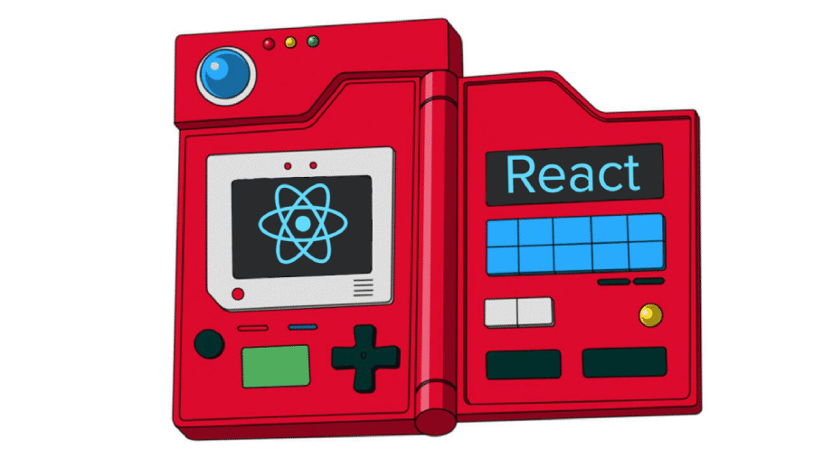
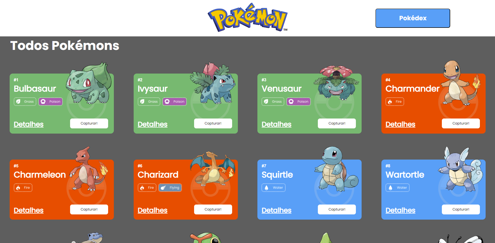
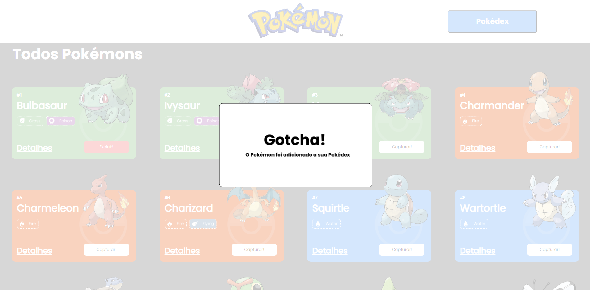
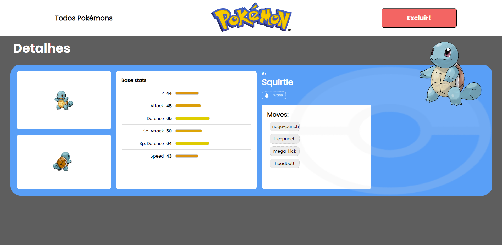

# **Pokédex**

Um projeto de Pokédex, do desenho Pokémon, na qual mostra 24 pokemons de tipos de diferente. No site inicial, é possível adicionar pokémons para a sua pokédex, assim como também é possível remove-los e inspecionar os detalhes de cada um.
Este projeto utilizou uma API pública muito utilizada para aplicações focadas em aprendizados na área de programação, que se chama [Poke Api](https://pokeapi.co/ "Poke Api").

## **Índice**

- <a href="#funcionalidades">Funcionalidades do projeto</a>
- <a href="#layout">Layout</a>
- <a href="#demonstracao">Demonstração</a>
- <a href="#rodar"> Como rodar este projeto?</a>
- <a href="#tecnologias">Tecnologias Utilizadas</a>
- <a href="#autoras">Pessoas Autoras</a>

## 💻 **Funcionalidades do Projeto**

- **Geral:**
  - [x] O site deve ter 3 páginas: Home, Pokedex e Detalhes;
  - [x] Projeto deve seguir o [design](https://www.figma.com/file/KseyA2Ofghiek2Cy3ZaDre/Poked%C3%A9x?t=AEi3zEmWmarf1FbP-0 "design") proposto;
  - [x] O fluxo de trocas de páginas devem ser semelhante ao [fluxograma](https://www.figma.com/proto/KseyA2Ofghiek2Cy3ZaDre/Poked%C3%A9x?page-id=0%3A1&node-id=2%3A2&viewport=358%2C197%2C0.27&scaling=scale-down&starting-point-node-id=2%3A2 "fluxograma");
- **Página Home:**
  - [x] Mostrar uma lista de Pokemons, contendo ao menos 20 Pokemons;
  - [x] Cada Pokemon será representado por um Card;
  - [x] Em cada card de Pokemon tem um botão para adicioná-lo à Pokedex e um outro botão para acessar os detalhes do Pokemon;
  - [x] Header dessa página terá um botão para acessar a página da Pokedex
  - [x] Há uma função de paginação
- **Página Pokédex**
  - [x] Renderizar a lista de pokémons adicionados na pokedex;
  - [x] Em cada card de Pokemon deve ter um botão para removê-lo da Pokedex e um outro botão para acessar os detalhes do Pokemon.
  - [x] Header deve ter um botão para voltar para a Home
  - [x] Não deve ser possível adicionar o mesmo Pokemon duas vezes na Pokedex
- **Página de Detalhes**
  - [x] Mostrar os detalhes do Pokemon selecionado, com informações descritas
  - [x] Header deve ter um botão para adicionar ou remover da Pokedex e outro para voltar a página home.

## 📺 **Layout**

- **Página Inicial**
  
- **Adicionar na Pokédex**
  
- **Remover da Pokédex**
  
- **Pokédex**
  
- **Página de Detalhes**
  

## 📀 **Demonstração**

[Link demostração](https://tightfisted-pets.surge.sh/)

## ⚙️ **Como Rodar este projeto**

```bash
# Clone este repositório
$ git clone https://github.com/rodolfofreitass/projeto-react-apis

# Acesse a pasta do seu projeto no seu terminal
cd projeto-react-apis

# Instale as dependências
$ npm install

# Execute a aplicação
$ npm run start

# A aplicação sera iniciada na porta 3000, acesse pelo navegador: http://localhost:3000
```

## 🛠 **Tecnologias Utilizadas**

1. [React.js](https://react.dev/)
2. [React Router](https://reactrouter.com/en/main/start/overview)
3. [Styled-components](https://styled-components.com/)
4. [React Context](https://reactjs.org/docs/context.html)
5. [Hooks](https://reactjs.org/docs/hooks-intro.html)
6. [Axios](https://axios-http.com/ptbr/docs/intro)

## 🧑 **Pessoas Autoras**

**Rodolfo Freitas**


[Linkedin](https://www.linkedin.com/in/rodolfofrts/)
